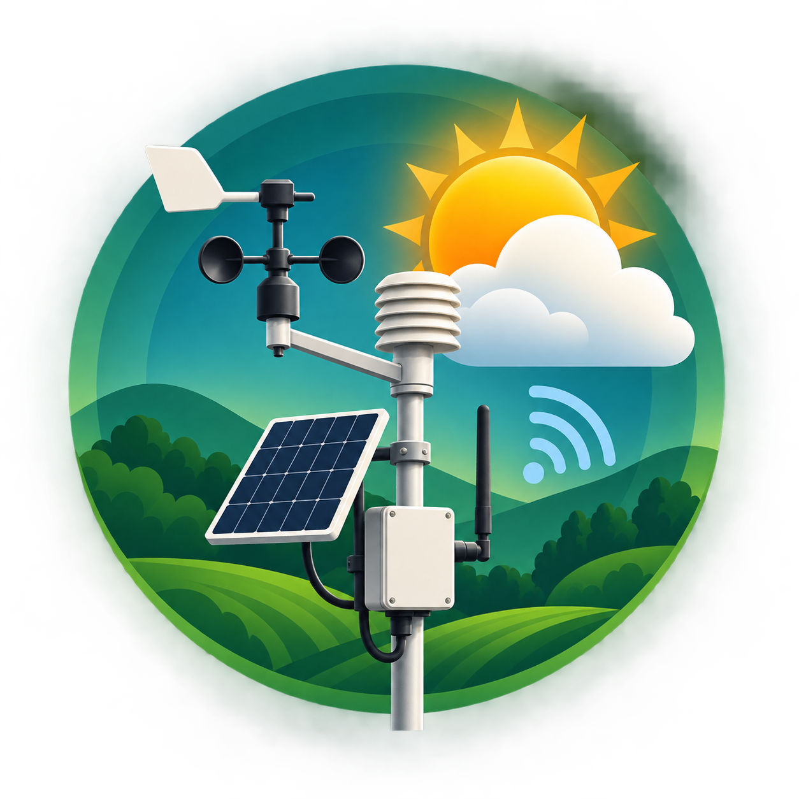

# GSM Weather Monitoring Station



A full-stack weather telemetry product for an Arduino Uno, AHT20, BMP280, 16x2 I2C LCD and SIM800L on MTN Nigeria. The station displays measurements locally, sends a five-minute HTTPS telemetry record to a protected Supabase Edge Function, and exposes read-only observations through a mobile-first dashboard.

> Current status: local implementation. Cloud resources, a real SIM800L TLS session, physical sensor behavior, and Android APK are not yet verified.

## System map

```text
AHT20 + BMP280 -- I2C --> Arduino Uno --> LCD
                               |
                         D10/D11 serial
                               |
                         SIM800L + MTN
                               |
                         HTTPS station key
                               v
                    Supabase Edge Function
                               |
                    PostgreSQL with RLS
                               |
                    React/PWA dashboard
```

## Repository

- `firmware/WeatherStationUno` — Uno firmware and safe secret template
- `supabase/migrations` — schema, constraints, indexes, seed, grants, and RLS
- `supabase/functions/ingest-weather` — authenticated validation and insert API
- `dashboard` — React, TypeScript, Vite, Recharts, PWA manifest, Capacitor config
- `docs` — wiring, deployment, troubleshooting, and verification boundary

## Quick start

1. Read [installation and wiring](docs/INSTALLATION_AND_WIRING.md), especially the SIM800L power warning.
2. Copy `firmware/WeatherStationUno/secrets.example.h` to `secrets.h` and configure it locally.
3. Create a new Supabase project only after confirming its organization, region, and quoted cost.
4. Apply the migration, deploy the function with JWT verification disabled deliberately, and set `WEATHER_STATION_API_KEY` as a function secret.
5. Copy `.env.example` to `dashboard/.env.local`, use only the publishable key, then run `npm install && npm run dev` in `dashboard`.

## Android debug build

From `dashboard`, run `npm run android:build`. The verified debug artifact is generated at `android/app/build/outputs/apk/debug/app-debug.apk`. This debug-signed package is for testing only; release signing, Play Store configuration, and real-device behavior require separate verification.

The browser has public `SELECT` access to active stations and their readings because this is designed as an academic public weather dashboard. It has no insert, update, or delete grants or policies. Device writes go only through the authenticated server-side function.

## Verification boundary

Compilation proves source compatibility, not wiring, modem power integrity, MTN registration, SIM800L TLS compatibility, or successful Supabase ingestion. See [verification checklist](docs/VERIFICATION_CHECKLIST.md).
